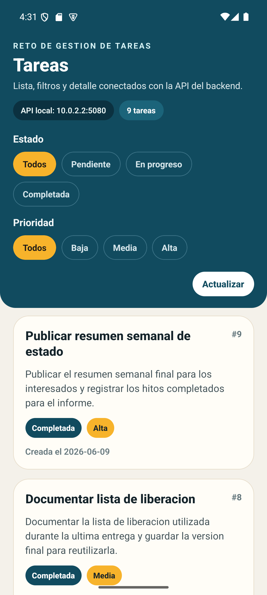

# Reto Tecnico Task Management

Aplicacion full stack para consultar tareas con filtros por estado y prioridad desde una API .NET y una app movil React Native.



## Funcionalidades

- API REST para listar tareas y consultar una tarea por ID.
- Filtros combinables por `status` y `priority`.
- Validacion de filtros invalidos con `ProblemDetails`.
- Persistencia en SQL Server mediante procedimientos almacenados.
- App movil con listado, recarga, filtros, estado vacio y detalle de tarea.
- Cliente HTTP movil centralizado con Axios.

## Estructura Del Repositorio

```text
backend/
  src/
  tests/
database/
docs/
mobile/
screenshots/
```

## Requisitos Previos

- .NET 10 SDK
- Node.js 22.22.0
- npm 10+
- JDK 17
- Android SDK Platform 35 y 36
- Android Build Tools 36.0.0
- Android NDK 27.1.12297006
- SQL Server o LocalDB

## Configuracion De SQL Server

La base objetivo es `TaskManagementDb`. Los scripts versionados no almacenan credenciales ni cadenas privadas.

### Orden De Ejecucion

1. `database/01-create-database.sql`
2. `database/02-create-schema.sql`
3. `database/03-create-procedures.sql`
4. `database/04-seed-data.sql`
5. `database/05-verify-database.sql`

Si ya existe una base creada con datos en ingles, ejecuta adicionalmente:

6. `database/06-localize-existing-tasks-to-spanish.sql`

### Ejemplo Con `sqlcmd`

```powershell
$SqlServer = "localhost\SQLEXPRESS"

sqlcmd -S $SqlServer -E -C -b -i .\database\01-create-database.sql
sqlcmd -S $SqlServer -E -C -b -i .\database\02-create-schema.sql
sqlcmd -S $SqlServer -E -C -b -i .\database\03-create-procedures.sql
sqlcmd -S $SqlServer -E -C -b -i .\database\04-seed-data.sql
sqlcmd -S $SqlServer -E -C -b -i .\database\05-verify-database.sql
```

## User Secrets Del Backend

La API espera la cadena de conexion en `ConnectionStrings:TaskManagement`.

Ejemplo generico:

```powershell
cd .\backend

dotnet user-secrets set `
  "ConnectionStrings:TaskManagement" `
  "Server=(localdb)\MSSQLLocalDB;Database=TaskManagementDb;Trusted_Connection=True;TrustServerCertificate=True;" `
  --project .\src\TaskManagement.Api\TaskManagement.Api.csproj
```

## Ejecucion Del Backend

```powershell
cd .\backend

dotnet restore .\TaskManagement.sln
dotnet build .\TaskManagement.sln --configuration Release --no-restore
dotnet run --project .\src\TaskManagement.Api\TaskManagement.Api.csproj --launch-profile TaskManagement.Api
```

La API queda expuesta en `http://localhost:5080`.

## Endpoints

- `GET /api/tasks`
- `GET /api/tasks?status=Pending`
- `GET /api/tasks?priority=High`
- `GET /api/tasks?status=Pending&priority=High`
- `GET /api/tasks/{id}`

## Ejecucion Del Movil

```powershell
cd .\mobile

npm ci
adb reverse tcp:8081 tcp:8081
npm start
```

En otra terminal:

```powershell
cd .\mobile
npm run android
```

La app Android usa `http://10.0.2.2:5080` para acceder a la API desde el emulador.

## Evaluacion Y Cumplimiento

[Ver informe final de cumplimiento](./docs/challenge-compliance-report.md)

## Pruebas

### Backend

```powershell
cd .\backend
dotnet test .\TaskManagement.sln --configuration Release
```

### Movil

```powershell
cd .\mobile
npm test -- --runInBand
npx tsc --noEmit
npm run lint
npx react-native doctor
```

## Limitaciones

- El flujo movil esta preparado y tipado, pero la validacion visual final depende de un emulador Android disponible localmente.
- La configuracion de SQL Server depende de la instancia presente en cada maquina.
- No se implementaron mutaciones de tareas porque el reto se enfoca en consulta, filtros y detalle.

## Mejoras Futuras

- Agregar cliente HTTP con interceptores y reintentos.
- Incorporar pruebas E2E del flujo movil.
- Agregar paginacion y busqueda textual.
- Incluir CI para build, test y lint automaticos.

## Documentacion Adicional

- [Arquitectura](./docs/architecture.md)
- [Decisiones tecnicas](./docs/technical-decisions.md)
- [Informe final de cumplimiento](./docs/challenge-compliance-report.md)
- [Guia del movil](./mobile/README.md)
