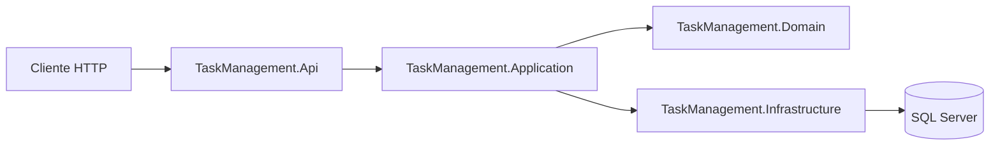
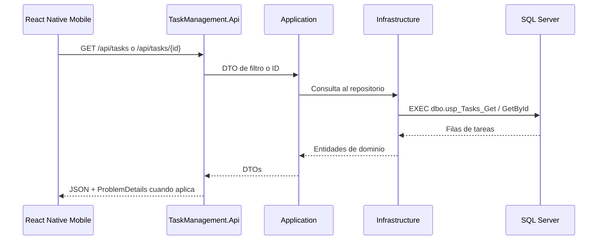

# Arquitectura

## Backend



## Flujo Mobile A API A SQL Server



## Flujo De Listado Y Filtrado

```mermaid
flowchart TD
    Start[Usuario abre TaskListScreen] --> Load[Solicitar tareas]
    Load --> Filters{Hay filtros activos?}
    Filters -- No --> All[GET /api/tasks]
    Filters -- Si --> Query[GET /api/tasks?status=...&priority=...]
    All --> Render[Renderizar tarjetas]
    Query --> Render
    Render --> Tap[Usuario toca una tarjeta]
    Tap --> Detail[Navegar a TaskDetailScreen]
    Detail --> ById[GET /api/tasks/{id}]
    ById --> Show[Mostrar detalle]
```
